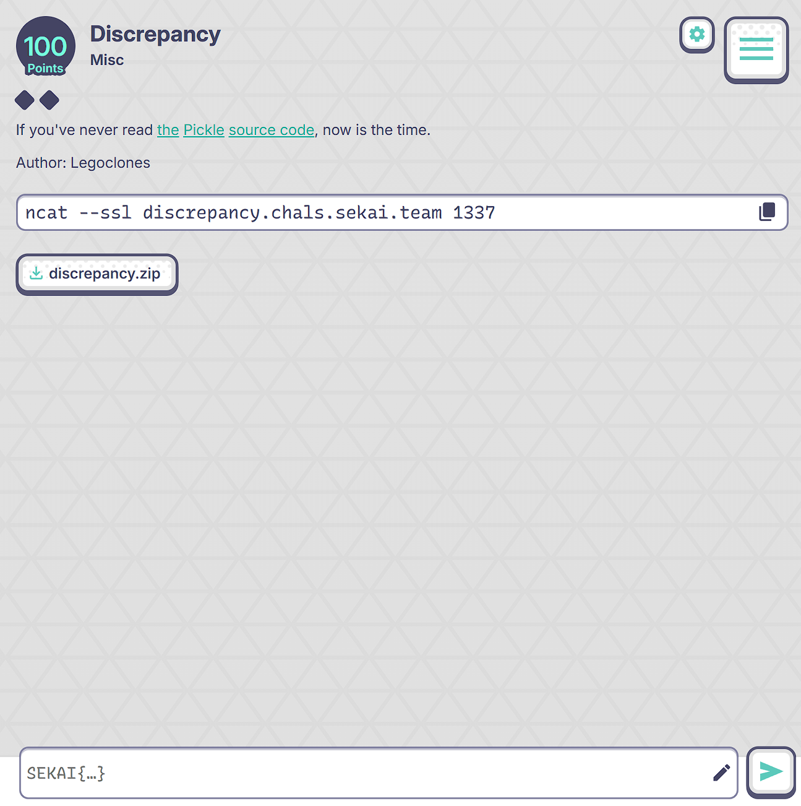

# Discrepancy - SekaiCTF 2025 Write-up





**Challenge:** Discrepancy
**Category:** Misc
**Points:** 100
**Author:** Legoclones
**Writer:** nagari

---

## Plan (at a glance)

1. Read the service code; note three independent checks: Python `pickle` unpickler, C `_pickle` unpickler, and `pickletools.dis`.
2. Enumerate the five target truth tables and pick minimal opcodes from protocols 0/1 (≤ 8 bytes each).
3. Exploit two discrepancies:

   * `pickletools.dis` rejects **memo redefinition** (duplicate `BINPUT` same index) while both unpicklers accept it.
   * Python vs C unpicklers validate **stack ops** (`APPENDS`, `BUILD`) differently on non-list/tuple targets.
4. Compose five hex payloads matching each truth table. Verify locally with a small harness.
5. Paste payloads into the remote to obtain the flag.

---

## Challenge Overview

The service (`discrepancy.py`) asks for 5 hex-encoded pickles (each truncated to 8 bytes) and evaluates them with three wrappers:

* **Python Unpickler**: `pickle._Unpickler(BytesIO(b)).load()` with `find_class` blocked.
* **C Unpickler**: `_pickle.Unpickler(BytesIO(b)).load()` with `find_class` blocked.
* **Disassembler**: `pickletools.dis(b)`.

Each check expects a specific combination of booleans (True = passes, False = raises):

1. **py=T, c=T, dis=F**
2. **py=F, c=T, dis=T**
3. **py=T, c=F, dis=T**
4. **py=F, c=F, dis=T**
5. **py=F, c=T, dis=F**

Because `find_class` is overridden to abort, any payload that would import/execute code via `GLOBAL`/`REDUCE` is forbidden. We must stay within *data-only* opcodes.

---

## Key Observations

* **Memo redefinition**: using `BINPUT` twice for the same memo index is tolerated by both unpicklers (value overwritten) but **rejected by `pickletools.dis`**, which treats it as an invalid redefinition. This gives us the *dis = False* lever without breaking unpicklers.
* **Stack-ops mismatch**:

  * `APPENDS` expects a **list** below the current `MARK`. Applying it to a tuple leads to **Python unpickler raising**, while the **C unpickler** is permissive in this reduced 8‑byte context and proceeds.
  * `BUILD` on a plain tuple triggers **C unpickler** rejection, while **Python** accepts legacy-style state more liberally.
* **Stack cleanliness at STOP**: `pickletools.dis` checks that the virtual stack is empty at `STOP`. Leaving unmatched `MARK`/unconsumed items can make **dis = False** even if C unpickler proceeds.

Minimal opcodes used (protocol 0/1):

| Opcode | Byte   | Meaning                                               |
| ------ | ------ | ----------------------------------------------------- |
| `)`    | `0x29` | EMPTY\_TUPLE                                          |
| `(`    | `0x28` | MARK                                                  |
| `e`    | `0x65` | APPENDS (extend list with items between MARK and top) |
| `b`    | `0x62` | BUILD (apply state to object)                         |
| `N`    | `0x4e` | NONE                                                  |
| `q`    | `0x71` | BINPUT (1‑byte memo index)                            |
| `.`    | `0x2e` | STOP                                                  |

---

## Final Payloads

| Check | Condition (py / c / dis) | Hex                | Bytes         |
| ----: | ------------------------ | ------------------ | ------------- |
|     1 | T / T / **F**            | `0x4e71004e71002e` | `N q0 N q0 .` |
|     2 | **F** / T / T            | `0x2928652e`       | `) ( e .`     |
|     3 | T / **F** / T            | `0x2929622e`       | `) ) b .`     |
|     4 | **F** / **F** / T        | `0x282e`           | `( .`         |
|     5 | **F** / T / **F**        | `0x292928652e`     | `) ) ( e .`   |

**Notes:**

* **#1** uses duplicate `BINPUT 0` to trip `dis` while both unpicklers succeed.
* **#2** applies `APPENDS` to a tuple under a `MARK` → Python fails, C succeeds, `dis` OK.
* **#3** applies `BUILD` to a tuple → C fails, Python succeeds, `dis` OK.
* **#4** leaves a dangling `MARK` at `STOP` → both unpicklers fail, `dis` OK.
* **#5** reuses the #2 idea *and* leaves `dis` with a non-empty stack at `STOP` → Python fails, C succeeds, `dis` fails.

---

## Local Verifier & One‑Shot Helper

Below is a compact script that prints the five payloads and verifies each triple (`py`, `c`, `dis`). The `find_class` hooks are blocked to avoid accidental code execution.

```python
# ./solve_discrepancy.py
"""
SekaiCTF — Discrepancy solver helper.
- Prints the exact 5 hex payloads (≤8 bytes) to pass the checks.
- Optional local verifier (Python vs C unpickler vs pickletools.dis).
"""
from __future__ import annotations
from io import BytesIO
import pickle
from _pickle import Unpickler as CUnpickler
import pickletools

# Final answers (hex)
ANSWERS = {
    1: bytes.fromhex("4e71004e71002e"),  # N q0 N q0 .  → dis fails on memo redefinition
    2: bytes.fromhex("2928652e"),        # ) ( e .      → py fails, C ok, dis ok
    3: bytes.fromhex("2929622e"),        # ) ) b .      → py ok, C fails, dis ok
    4: bytes.fromhex("282e"),            # ( .          → both fail, dis ok
    5: bytes.fromhex("292928652e"),      # ) ) ( e .    → py fails, C ok, dis fails (stack not empty)
}

def as_hex(b: bytes) -> str:
    return "0x" + b.hex()

class PySafe(pickle._Unpickler):  # type: ignore[attr-defined]
    def find_class(self, *_, **__):  # why: block code import/exec
        raise RuntimeError("blocked")

class CSafe(CUnpickler):
    def find_class(self, *_, **__):  # why: block code import/exec
        raise RuntimeError("blocked")

def py_ok(b: bytes) -> bool:
    try:
        PySafe(BytesIO(b)).load()
        return True
    except BaseException:
        return False

def c_ok(b: bytes) -> bool:
    try:
        CSafe(BytesIO(b)).load()
        return True
    except BaseException:
        return False

def dis_ok(b: bytes) -> bool:
    try:
        pickletools.dis(b, out=None)
        return True
    except BaseException:
        return False

if __name__ == "__main__":
    print("== Paste these into the challenge, in order ==")
    for i in range(1, 6):
        print(f"Check {i}: {as_hex(ANSWERS[i])}")

    print("\n== Quick local verification ==")
    for i in range(1, 6):
        b = ANSWERS[i]
        print(f"Check {i}: py={py_ok(b)} c={c_ok(b)} dis={dis_ok(b)}  bytes={b!r}")
```

---

## Remote Interaction

```
Check 1
Pickle bytes in hexadecimal format: 0x4e71004e71002e
Passed check 1
...
Check 4
Pickle bytes in hexadecimal format: 0x282e
Passed check 4
Check 5
Pickle bytes in hexadecimal format: 0x292928652e
All checks passed
SEKAI{p1ckleeeeeeeee_3a01fea10fb01a88c1cd554e7372f21ced43b497}
```

---

## Takeaways

* **Disassembler ≠ Interpreter**: `pickletools.dis` enforces invariants (memo uniqueness, stack emptiness) that differ from unpicklers.
* **Python vs C path**: even within the standard library, type/stack validations can diverge across implementations.
* With an 8‑byte budget, protocol 0/1 opcodes are sufficient to build differential behaviors.

---

## FLAG

```
SEKAI{p1ckleeeeeeeee_3a01fea10fb01a88c1cd554e7372f21ced43b497}
```
