# World Wide Chilling - World Wide CTF 2025 Write-up


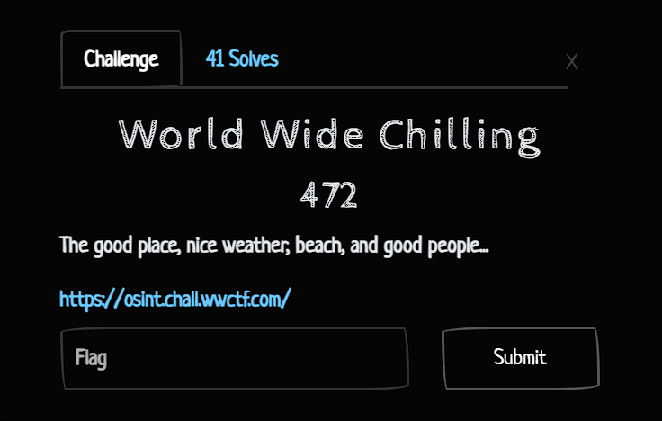


**Challenge:** World Wide Chilling
**Category:** OSINT
**Points:** 472
**Author:** nagari

### Introduction

This OSINT challenge titled "World Wide Chilling" was part of the World Wide CTF 2025 and featured a chain of 10 sequential questions. Participants had to solve each one correctly to proceed to the next. The structure encourages systematic investigation and persistence, mimicking how real-world OSINT work often builds upon multiple fragmented data points. The information required could be scattered across the web, PDFs, social media, or hidden in historical records. This write-up describes the process of solving each question and the strategies applied.

### Qestion 1: What event is this?

The image shown hints at a Capture The Flag (CTF) event, most notably due to the emblem and layout. Initially, I assumed it would be straightforward to identify it using visual recognition tools.

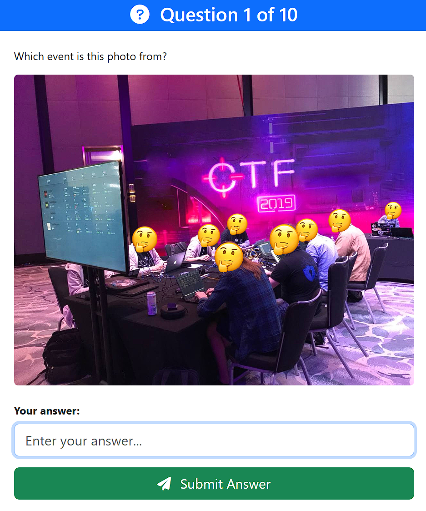

#### Step 1: Google Lens Fails

I started by extracting the image and submitting it to Google Lens. To my surprise, the tool failed to return any useful or relevant matches. It mostly produced unrelated logos and graphical noise.

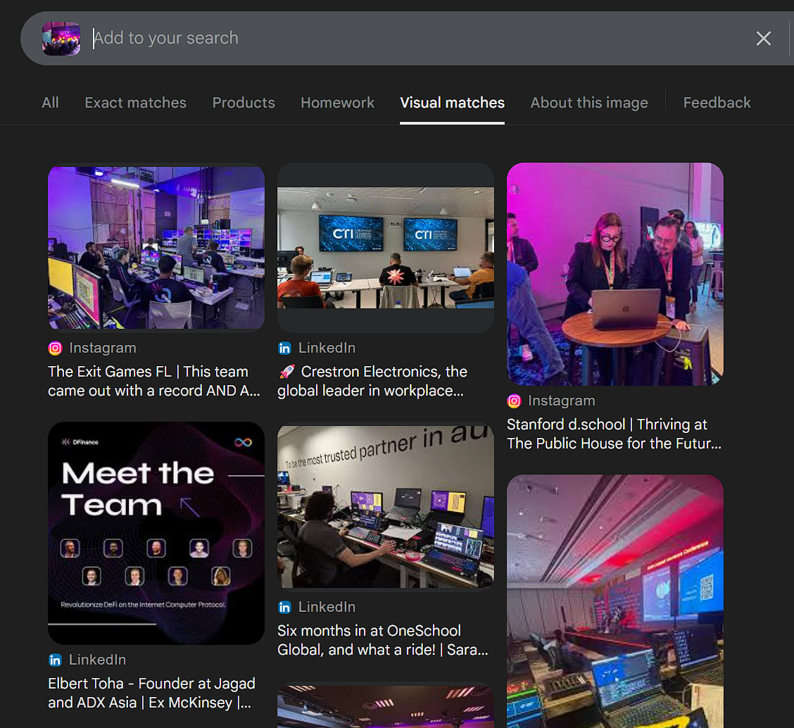

#### Step 2: Manual Keyword Search

After the automated method failed, I resorted to keyword-based searching. Using combinations like 'CTF 2019 logo', and other permutations, I finally landed on a match. The logo belonged to the **Kaspersky Industrial CTF 2019**, an event that was prominently displayed on several recap pages.

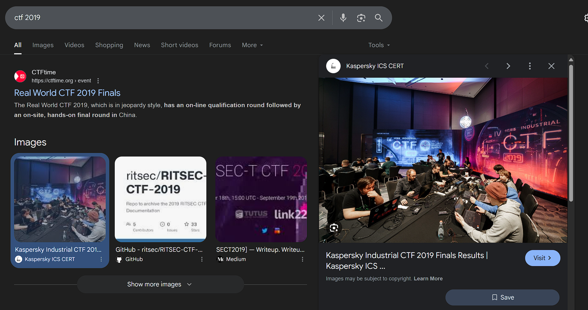

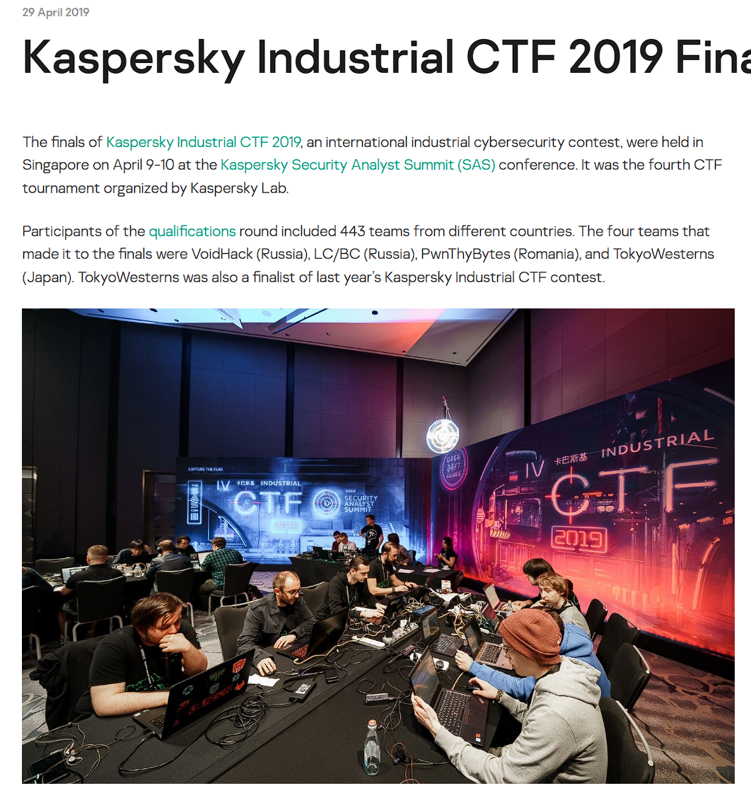

Answer: ```Kaspersky Industrial CTF 2019.```

### Qestion 2: Who ran this CTF?

Continuing from the previous clue, I revisited the website where the CTF was originally hosted. Scrolling through the details, I noticed the CTF was part of a larger cybersecurity conference.

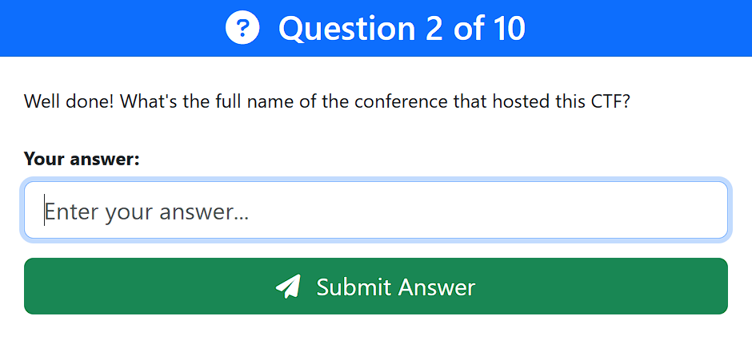

The official host behind the event was the Kaspersky Security Analyst Summit, often abbreviated as SAS. This was also mentioned in various blog posts and the official recap of the event.

Answer: ```Security Analyst Summit```

### Qestion 3: Where was the event held?

This question seemed simpler, as it was asking for the venue of the 2019 SAS event. By googling “SAS 2019 venue” or similar terms, I found that it took place in Singapore.

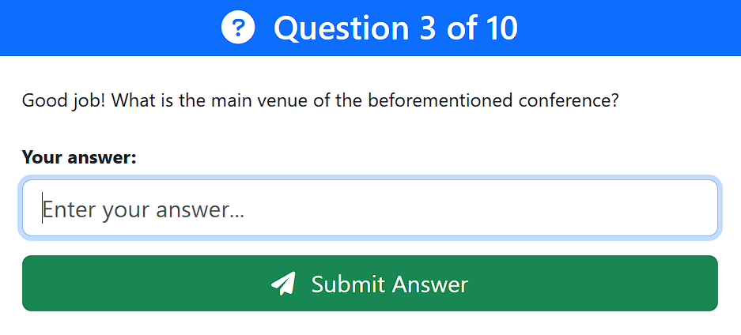

Digging deeper led me to a post confirming the exact venue: the Swissotel The Stamford, a well-known hotel and conference location in Singapore.

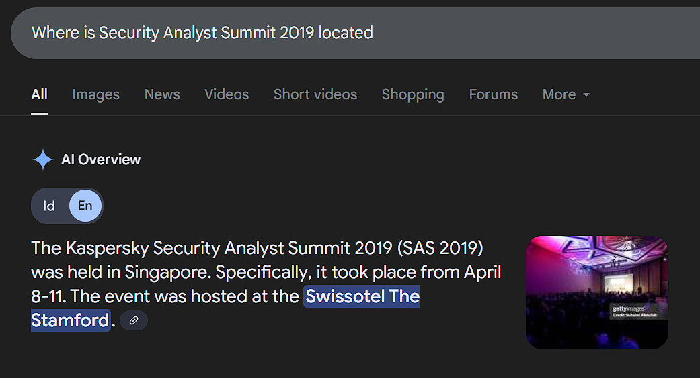

Answer: ```Swissotel The Stamford```

### Qestion 4: Where was SAS 2017 located?

For this question, the target was the 2017 edition of the SAS conference. I used the query 'SAS 2017 conference location' and filtered by reliable sources, especially those published by Kaspersky.

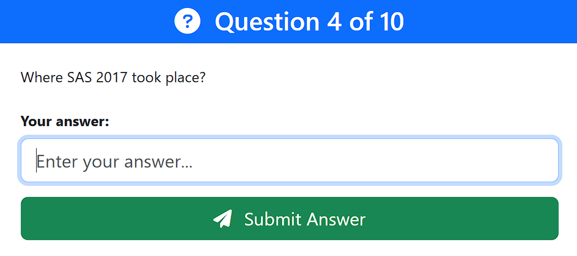

The location was listed on multiple blogs and the event's own archives as St. Maarten, an island in the Caribbean.

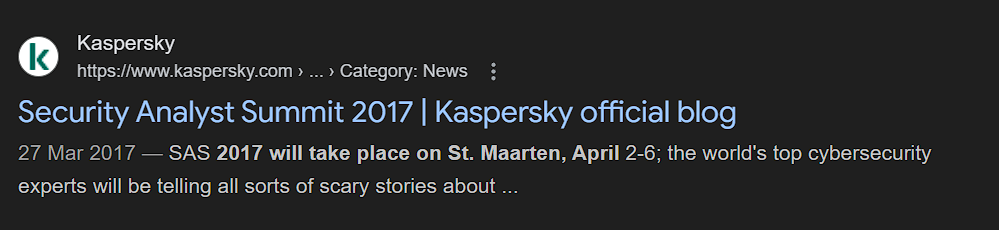

Answer: ```St. Maarten```

### Qestion 5: What IP?

Unlike the earlier questions, this one was more complex. It referenced a mini CTF held during the SAS 2017 event. The task was to identify an IP address associated with an SSH challenge.

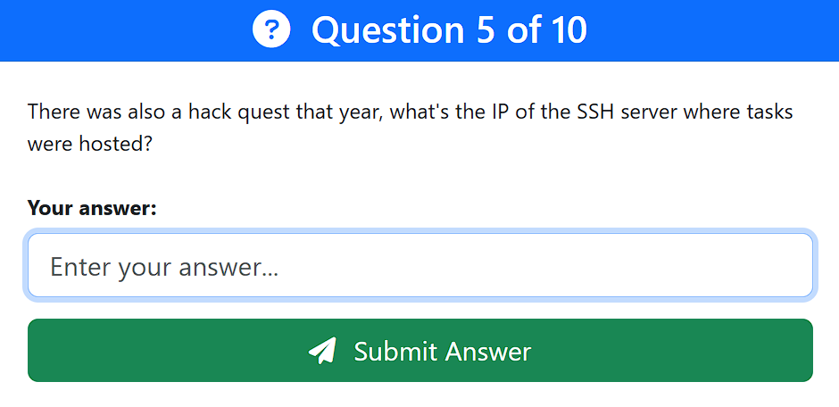

#### Step 1: Exhausting Conventional Sources

I tried searching for the phrase "SAS 2017 hack quest IP address" on Google, YouTube, and Reddit. Despite watching full recap videos and reading articles, the IP wasn't clearly listed anywhere.

#### Step 2: Searching on Twitter/X

I broadened my scope to social media and specifically searched the hashtag #theSAS2017 alongside the keyword CTF. Surprisingly, I found a tweet featuring a screenshot that included the SSH challenge IP address.

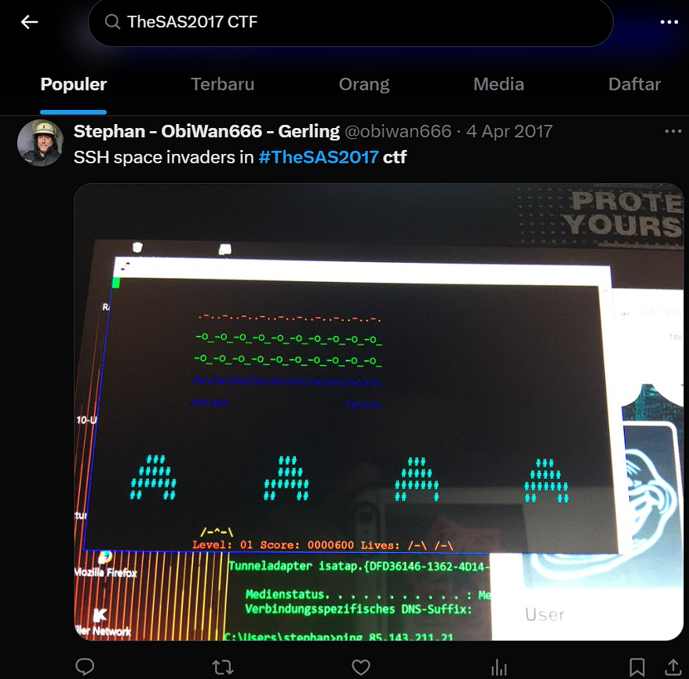

Answer: ```85.143.211.21```

### Qestion 6: Hashtag used during 2020 pandemic

In 2020, due to the COVID-19 pandemic, most in-person events were canceled or went online. Searching for “SAS 2020 hashtag” quickly brought up several posts referring to the adapted remote format of the event.

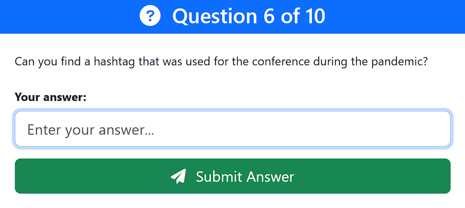

The official hashtag used during that period was:

Answer: ```#SASAtHome```

### Qestion 7: What Digital Coins? Bitcoin?

This question proved tricky. At first, I assumed the answer might be hidden in the 2024 SAS event material, but nothing was found. Then I noticed the subtle hint that we should look into the SAS 2025 PDF report.

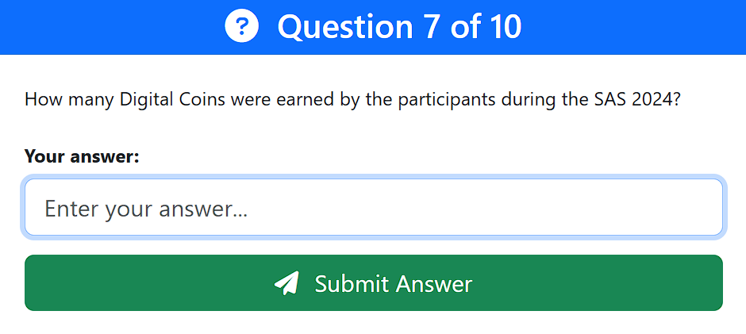

This question initially seemed straightforward—perhaps even a red herring. Naturally, I first assumed that the organizers might have embedded some hints within the official 2024 SAS event material. I scoured the event website and documentation, flipping through press releases and public announcements, but came up empty.

Next, I broadened the scope of my investigation to other possible public-facing clues. I went on YouTube and searched for any videos related to the SAS CTF finals, hoping to find footage, prize ceremonies, or interviews where digital coins—such as Bitcoin—might be mentioned as part of the prize pool. Again, nothing concrete turned up.

Still curious and not willing to dismiss the possibility, I turned to Twitter (now X) and looked up hashtags like #SASCTF, #SAS2024, and #SAS2025. My aim was to identify any participants sharing news or announcements regarding prizes, especially anything hinting at cryptocurrency involvement. Several promotional tweets did exist, but none offered clarity on any coins or digital assets involved in the competition.

At this point, I reconsidered the question's wording and context. The question explicitly referred to "Digital Coins" and prompted the question "Bitcoin?", as if to encourage me to think more deeply about Bitcoin. However, I reconsidered rephrasing the keywords to capture the topic of digital coins and that's it.

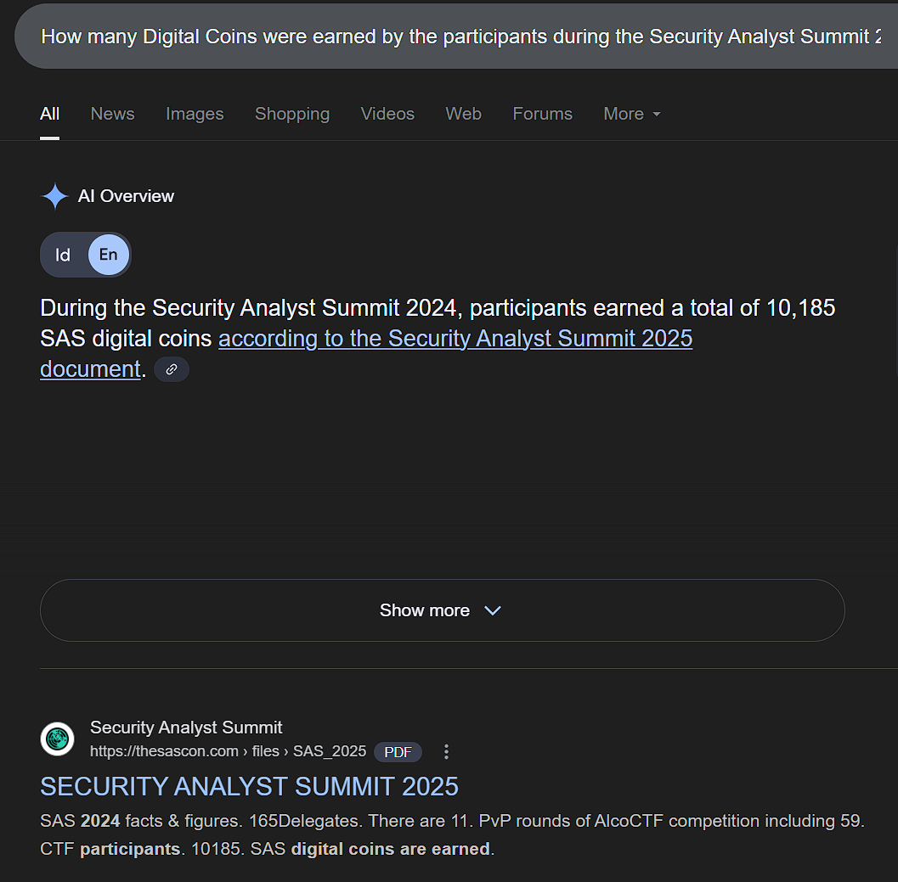

Answer: ```10185```

### Qestion 8: What is the name of the CTF? Easy!

The question asked for the name of the CTF competition affiliated with the SAS conference. This was consistently referred to in blogs and official write-ups.

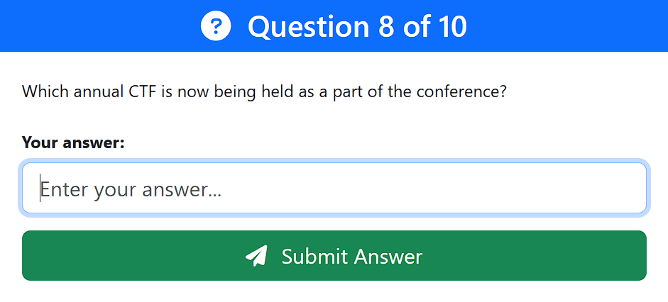

Jawabannya: ```SAS CTF```

### Qestion 9: Question 9, who got 9?

To answer this, I navigated to the official scoreboard of the SAS CTF 2024 edition. The scoreboard listed all team rankings in order.

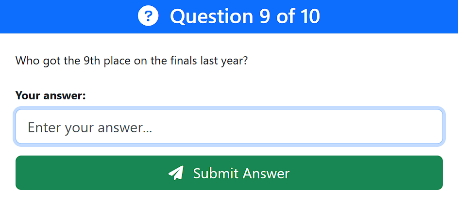

Upon reviewing the ninth position:

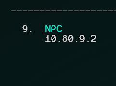

Answer: ```NPC```

### Qestion 10: Alternative Universe!

The final question asked about an alternative method of qualifying for the 2025 finals. While most would look at the 2024 website or recap, the correct clue was hidden in the SAS 2025 competition page.

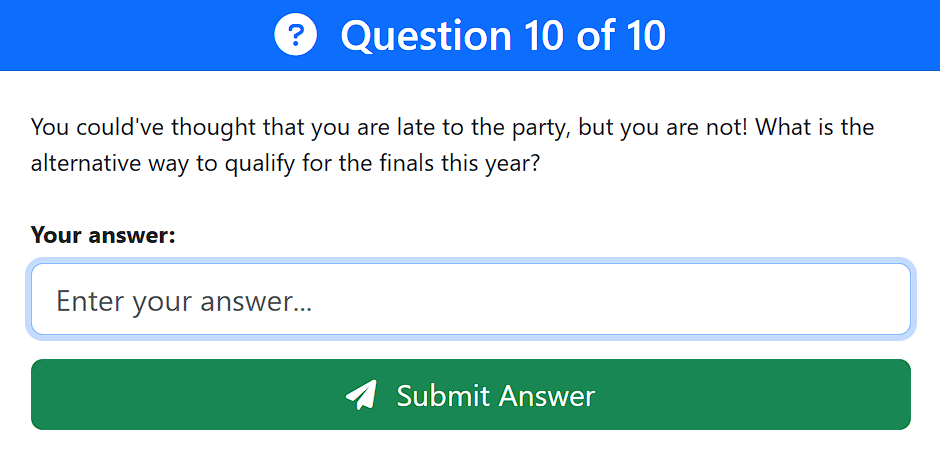

Reviewing the eligibility section, I discovered that solving a specific remote challenge could grant direct qualification. The password or code for this path was:

Answer: ```Kaspersky{CTF}```

### Finaly Flag Unlocked

After entering all the correct answers in sequence, the challenge rewarded the following flag:

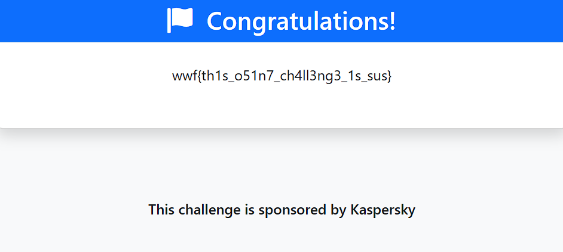

### FLAG
```
FLAG : wwf{th1s_o51n7_ch4ll3ng3_1s_sus}
```
